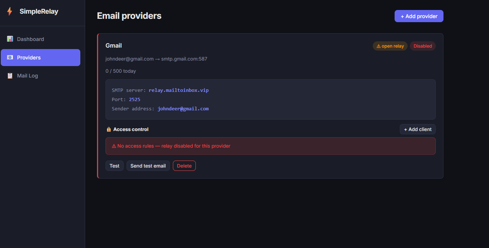

# SimpleRelay

Self-hosted multi-tenant SMTP relay with web dashboard. Routes outbound email through multiple upstream SMTP providers based on sender address. Built with FastAPI, Postfix, PostgreSQL, Docker.



## Demo

Try it at **[relay.mailtoinbox.vip](https://relay.mailtoinbox.vip)** - register a free account and test the full system.

## Configuration (.env)

### Required

| Variable | Description | Example |
|----------|-------------|---------|
| `RELAY_ADMIN_EMAIL` | Admin login email (created on first start) | `admin@example.com` |
| `RELAY_ADMIN_PASSWORD` | Admin password | `strongpassword` |
| `RELAY_SECRET_KEY` | JWT secret, generate with `python3 -c "import secrets; print(secrets.token_urlsafe(32))"` | `x7f...` |
| `RELAY_HOSTNAME` | Public hostname of this server (used in EHLO, shown in UI) | `relay.example.com` |
| `RELAY_PUBLIC_IP` | Server public IP (for SPF/PTR guidance) | `203.0.113.10` |
| `RELAY_BASE_URL` | Full URL of the web dashboard (for verification email links) | `https://relay.example.com:8080` |

### Database (PostgreSQL)

Default values work out of the box. Change passwords for production.

| Variable | Default |
|----------|---------|
| `POSTGRES_USER` | `simplerelay` |
| `POSTGRES_PASSWORD` | `simplerelay` |
| `POSTGRES_DB` | `simplerelay` |
| `RELAY_DATABASE_URL` | `postgresql://simplerelay:simplerelay@db:5432/simplerelay` |

### System SMTP (optional)

Used for sending verification and password reset emails to users. If left empty, these emails are logged to console only (dev mode).

| Variable | Description | Example |
|----------|-------------|---------|
| `RELAY_SMTP_HOST` | SMTP server | `smtp.gmail.com` |
| `RELAY_SMTP_PORT` | Port | `587` |
| `RELAY_SMTP_USER` | Username | `noreply@example.com` |
| `RELAY_SMTP_PASSWORD` | Password |
| `RELAY_SMTP_FROM` | From address | `noreply@example.com` |
| `RELAY_SMTP_TLS` | Use STARTTLS | `true` |

### Ports

| Port | Service |
|------|---------|
| `8080` | Web dashboard |
| `2525` | SMTP relay (your apps connect here) |

Remap in `docker-compose.yml` if needed.

## Quick Start

```bash
git clone https://github.com/toinbox/simplerelay.git
cd simplerelay
cp env.example .env
nano .env
docker compose up --build -d
```

Dashboard: `http://your-server:8080`
SMTP relay endpoint: `your-server:2525`

## User Panel

Every registered user gets access to:

**Dashboard** - overview of today's sent count, errors, provider health status with response times, and recent mail log entries.

**Setup Wizard** - guided first-time setup: enter email, auto-detect provider and SMTP settings, test connection, run DNS check (SPF/DKIM/DMARC), configure access control (IP whitelist, optionally SMTP AUTH), send test email.

**Providers** - manage SMTP providers (upstream accounts used for sending). Each provider has:
- Auto-detection of SMTP settings from email address (Gmail, Outlook, Yahoo, Seznam, Zoho, SES, SendGrid, Mailgun, or custom SMTP)
- App password guidance for providers that require it (Gmail, Outlook, Yahoo) with direct links
- SMTP connection test
- DNS validation (SPF, DKIM, DMARC) with provider-aware DKIM selector scanning
- Send test email through the relay
- Daily sending limit with usage counter
- Per-provider access control (required) - IP whitelist is mandatory for the relay to accept connections. SMTP AUTH credentials can be added as additional authentication. Supports password generation, show/hide toggle, and regeneration.

**Mail Logs** - searchable log of all sent, failed, and bounced messages with sender, recipient, subject, status, client IP, and timestamp.

## Admin Panel

Admin users see additional sections:

**User Management** - list all registered users, activate/deactivate accounts (deactivation auto-suspends all user's relays), change user roles (user/admin), set maximum number of relays per user, set relay expiry period (auto-expire after N days), delete users with cascade.

**Proxy Management** - manage outbound IPs and SOCKS5/HTTP proxies. Each proxy entry has:
- Protocol selection (direct IP, SOCKS5, HTTP)
- Provider type filtering (assign specific proxies to specific provider types, e.g. Gmail proxies vs. catch-all)
- Round-robin assignment with load tracking
- Proxy testing (HTTP connectivity + SMTP handshake through proxy)
- Enable/disable toggle

**Provider Type Limits** - set global daily sending limits per provider type (Gmail, Outlook, Seznam, custom, etc.) applied across all users.

**Admin Dashboard** - global stats: total/active users, total/active/locked relays, total/active proxies, sent and errors today.

**Provider Oversight** - view any user's relay list, lock/unlock individual providers with reason.

## System Features

- Postfix-based relay with per-sender routing to correct upstream SMTP
- Built-in policy server (access control) - every provider requires a whitelisted IP address. Without it, the relay rejects all connections. SMTP AUTH credentials are optional as additional layer. No open relay possible.
- Automatic provider detection from email address (MX/DNS lookup fallback for unknown domains)
- User registration with email verification, password reset, password change
- JWT authentication with httponly cookies
- Relay expiry - providers auto-expire after admin-configured number of days
- Health monitoring - periodic SMTP connection checks with status tracking
- Multilingual UI - English, Czech, German, Russian, Spanish with runtime language switching
- Single Docker Compose deployment (Postfix + PostgreSQL + FastAPI + React/Vite)

## Home Network / Homelab Use Case

SimpleRelay works great as a central SMTP relay on your home network. Instead of configuring Gmail credentials in every device separately, you point everything at SimpleRelay on your LAN and manage credentials in one place.

```
Your home network (192.168.1.x)
┌─────────────────────────────────────────────────────────┐
│                                                         │
│  Proxmox ──────┐                                        │
│  Synology NAS ─┤                                        │
│  pfSense ──────┤    SimpleRelay          Gmail/Outlook   │
│  Grafana ──────┼──► 192.168.1.50:2525 ──► SMTP ──► ✉️  │
│  Uptime Kuma ──┤    (no auth needed)     (app password)  │
│  Home Asst. ───┤                                        │
│  Cameras ──────┘                                        │
│                                                         │
└─────────────────────────────────────────────────────────┘
  No NAT. No port forwarding. No public IP needed.
```

- 10 devices = 10 places to maintain Gmail app passwords. With SimpleRelay: one.
- No need for public IP, port forwarding, or your own mail server.
- Add `0.0.0.0/0` as allowed subnet and every device on your network can send.

See **[COMPATIBILITY.md](COMPATIBILITY.md)** for the full list of 50+ compatible devices with setup instructions - servers, firewalls, cameras, monitoring tools, backup software, UPS, printers and more.

## Tech Stack

FastAPI (Python 3.12), Postfix, PostgreSQL 16, React + Vite, Docker Compose

## License

MIT
